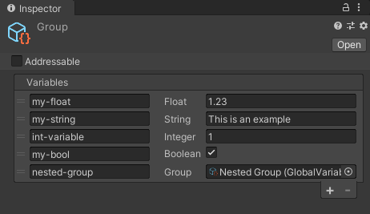
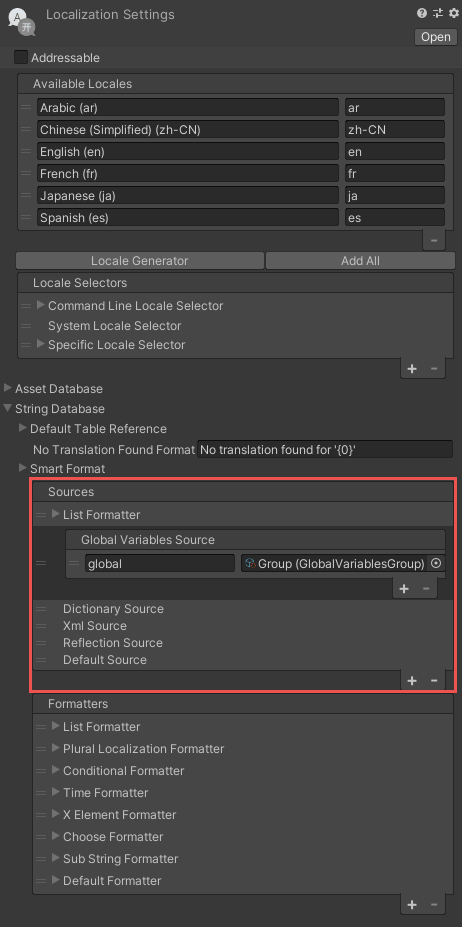

# Global Variables

The **Global Variables Source** pulls data from an external source and converts it into a **Smart String** without requiring any additional arguments.
When the value of a Global Variable changes, you can configure it to automatically update any **LocalizedStrings** that currently use it.

Access Global Variables by using dot notation inside a placeholder with the following structure:

```
{group-name.variable-name}
{group-name.nested-group-name.variable-name}
```

## Global Variables Group

A Global Variables Group is an asset that can contain one or more **Global Variables** and/or **Nested Global Variable Groups**.
Create a Global Variable Group through the Assets menu: **Assets > Create > Localization > Global Variables Group**



Each Global Variable has a name which must contain no spaces and be unique to the group.
Add new variables to a Global Variable Group by selecting the Add (+) button. 

## Global Variables Source

To allow **Smart Strings** to access **Global Variables**, you must add a **Global Variables Source** to the **Smart Format Sources** list.



You can add Global Variable Groups to the list, so long as each group has a unique name with no spaces.

The following example shows a single group with the name global.


| **Smart String**                                                             | **Result**                                      |
| ---------------------------------------------------------------------------- | ----------------------------------------------- | 
| My Floats value is `{global.my-float}`                                       | My Floats value is `1.23`                       |
| `{global.my-string}` of using global variables.                              | `This is an example` of using global variables. |
| The door is `{global.my-bool:Open\|Closed}`.                                  | The door is `Open`.                             |
| This is an integer `{global.int-variable}` as Hex `{global.int-variable:X}`. | This is an integer `255` as Hex `FF`.           |
| Values can be nested `{global.nested-group.player-name}`                     | Values can be nested `Player 1`                 |

## Triggering Updates

Global Variables can trigger automatic updates to any **LocalizedStrings** that are currently using it. This means there is no need to keep track of what UI fields need to be updated. If a value changes, the **LocalizedStrings** automatically update to the new value. 
To configure a Global Variable to automatically update **LocalizedStrings**, have the Global Variable implement the **IGlobalVariableValueChanged** interface. 
The LocalizedString checks which Global Variables it references, and adds itself to the Value Changed events of those Global Variables. When a value is changed, the Value Changed events run and the **LocalizedStrings** are automatically refreshed to the new value.

[!code-cs[value-change-example](../DocCodeSamples.Tests/GlobalVariablesSamples.cs#value-change-example)]

You can choose to stop the automatic updates of the LocalizedStrings when changing multiple Global Variables by updating within a **GlobalVariablesSource Update Scope**. Use this to prevent unnecessary updates. 

[!code-cs[update-scope-example](../DocCodeSamples.Tests/GlobalVariablesSamples.cs#update-scope-example)]

## Custom Global Variables

A custom Global Variable must be Serializable and implement **IGlobalVariable**.
The following example demonstrates how to use a Global Variable to return the current time.

[!code-cs[date-time-example](../DocCodeSamples.Tests/GlobalVariablesSamples.cs#date-time-example)]

The **IGlobalVariableValueChanged** interface must be implemented in order to trigger updates to any LocalizedString that uses the Global Variable.

[!code-cs[custom-value-changed-example](../DocCodeSamples.Tests/GlobalVariablesSamples.cs#custom-value-changed-example)]

## Custom Global Variable Groups

Use Custom Global Variable Groups to return custom Global Variables. The following example demonstrates this.

[!code-cs[custom-group-example](../DocCodeSamples.Tests/GlobalVariablesSamples.cs#custom-group-example)]
