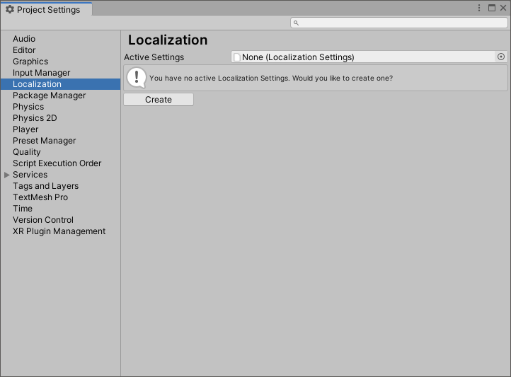
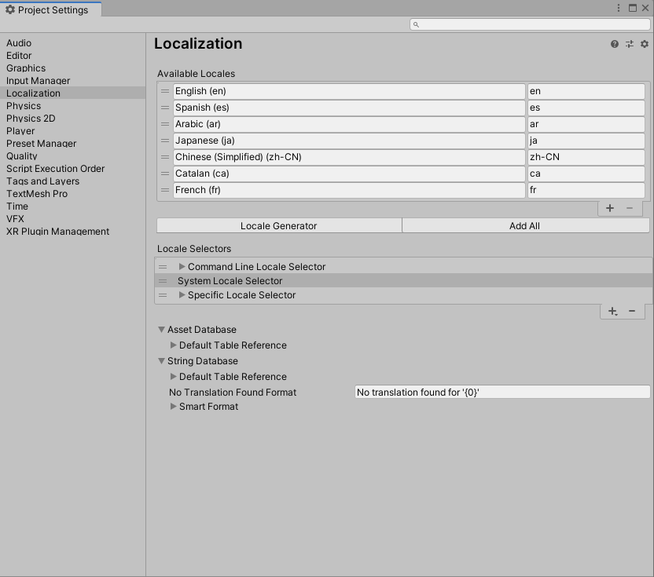
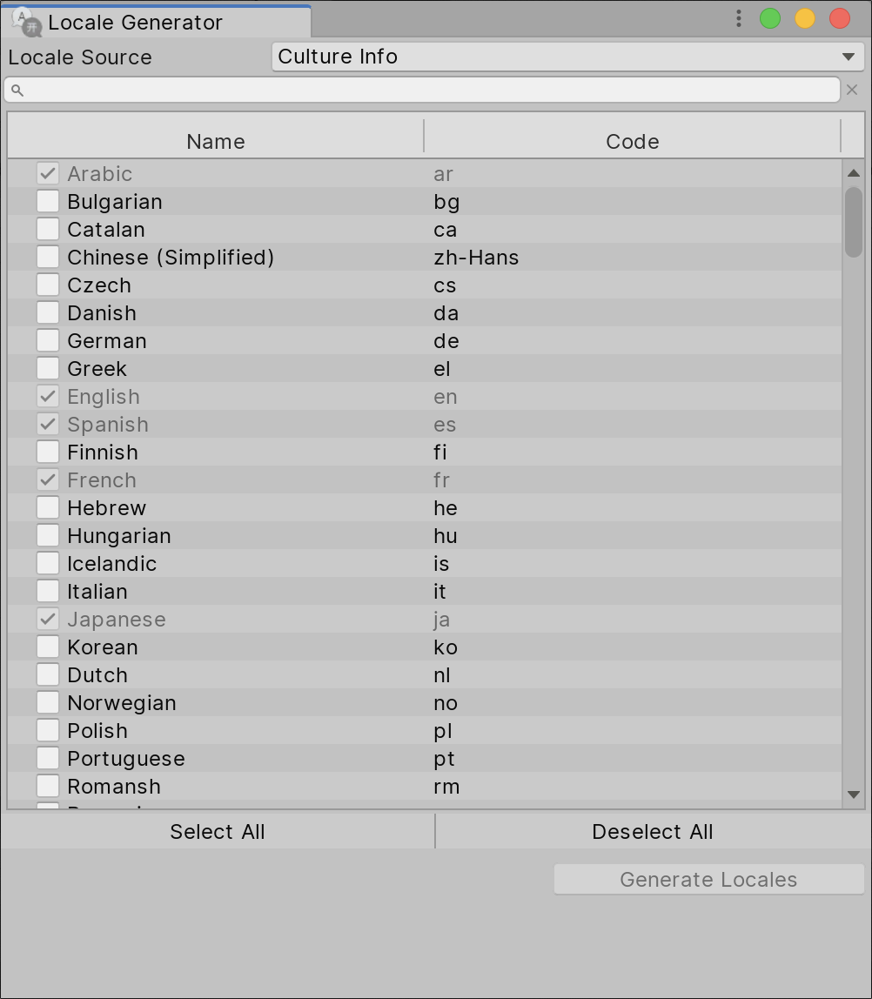
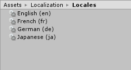

# Localization Settings
The Localization Settings Inspector window is the access point for all things localization-based. It provides an interface to accessing the Project Locales and Asset Tables for the Project.

## Accessing the Settings
To access the Localization Settings navigate to **Edit > Project Settings > Localization.**

If no settings Asset exists, Unity displays a prompt to create one.

You can also create the settings Asset through the Assets menu. Navigate to **Assets > Create > Localization > Localization Settings.**

## Available Locales
**Available Locales** contains the list of [locales](Locale.md) that the Project supports when built.
By default, this uses the Addressable system to fetch Locales. However, you can also create a class that implements *ILocalesProvider* to completely customize this.

### Locale Generator window
To create a Locale, click the **Locale Generator** button in the Available Locales editor.

The Locale Generator provides a set of known Locales that you can select and save to the Project.

Use the **Locale Source** field to control the source that Unity generates the list of Locales from. These known locales can be gathered from either the CultureInfo class or the Unity SystemLanguage enum.

To select a Locale, tick the check box next to its name. Once you have selected the the Locales you want, click the **Create Locales** button. This saves each Locale as an Asset in the Project and marks them as Addressable assets. Locales that are already included in the project will be shown as ticked and disabled.
Locale assets can be removed or added to Addressables by clicking the **Remove Selected** button to remove or **Add** button or the **Add All** button to add all Locale Assets in the project automatically.

## Locale Selector
The Locale Selector determines which Locale Unity should use when the application first starts or an active Locale is not selected. For example, you might want to use a default Locale, or attempt to use the Locale that the player is using on their device.

By default, there are 4 Locale Selectors to choose from however, you can create custom selectors by implementing the *IStartupLocaleSelector*  interface.

The Localization Settings will query each selector in the list, starting at the top(index 0). If a selector returns null, then it queries the next, until it finds a valid Locale or it reaches the end of the list. This allows you to create fallback behaviors when Unity is selecting which Locale to use.

## Asset Database
The Asset Database is responsible for retrieving the various Asset Tables and subsequent Assets, this involves querying and loading through the Addressable Assets system.
The **Default Table** field can be used to set a default Asset Table name, this can then be used when loading assets and not providing an explicit table name.

## String Database
The String Database is responsible for retrieving the various String Tables and subsequent localized strings.

The **Default Table** field can be used to set a default String Table name, this can then be used when loading strings and not providing an explicit table name.

The **No Translation Found Format** field can be used to configure the string that should be returned for non-localized values.

The **Smart Format** section can be used to configure the behavior when parsing and formatting [Smart Strings](SmartStrings.md)
