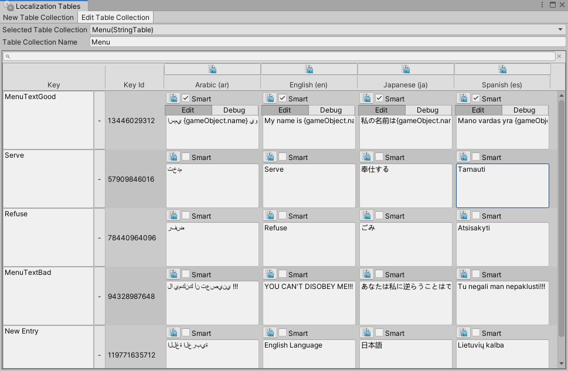
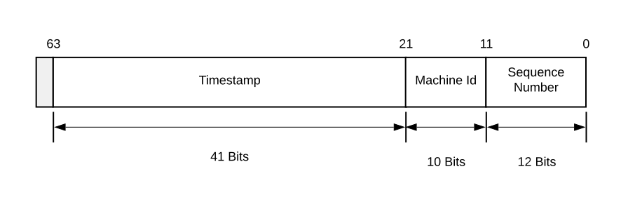

# Table Keys Generation

A Key provides a unique identifier for each entry in a String or Asset table. A key is made of two unique parts: the Key Name and the Key Id. 

A Localization Table displays the Key Name in the Key column, and the Key Id in the Key Id column.

You can change the Key Name, but not the Key Id. Unity uses the Key Id as a reference when accessing a table entry in an asset or component.

## Distributed ID generator

By default, Unity uses a distributed Key Id generator to provide a unique Key Id value specific to the machine that generates it. This means that it is safe for multiple users to work on the same Table. Note that you might need to resolve some merge conflicts, but because Unity never generates the same Key Id twice, resolving these conflicts should be straightforward.

A Key is a 64-bit long data type. It has the following structure:.

The 64-bit key is comprised of the following components:

| **Bits**                 | **Name** | **Description** |
| - | - | - |
| 12 (0-11)                 | Sequence Number | A local counter per machine that starts at 0 and increments by 1 for each new ID request that is made during the same millisecond. The value is limited to 12 bytes, so it can contain 4095 items before the IDs for this millisecond are exhausted and the ID generator must wait until the next millisecond before it can continue.
| 10 Bits (12-21)            | Machine Id | The ID of the machine. By default, in the Editor, this value is generated from the machine's network interface physical address. However, you can also set it to a custom value. There is enough space for 1024 machines.
| 41 Bits (22-63)            | Timestamp | A timestamp using a custom epoch (or start time), which is the time the class was created. The maximum timestamp that can be represented is 69 years from the custom epoch. At this point, the Key generator will have exhausted all possible unique Ids.
| 1 Bit (64)                 | [Signed Bit](https://en.wikipedia.org/wiki/Sign_bit) | The ID generator does not use the signed bit. If you want to add custom Id values, use the signed bit and add Key IDs with negative values to avoid conflicts.

## Custom ID generator

As an alternative to Unity’s distributed Key Id generation, you can apply a custom key generation method. To do this, use the SharedTableData property **KeyGenerator**.

The following example shows how to set an existing String Table Collection to use sequential keys.

[!code-cs[change-key-generator](../DocCodeSamples.Tests/ChangeKeyGenerator.cs)]
